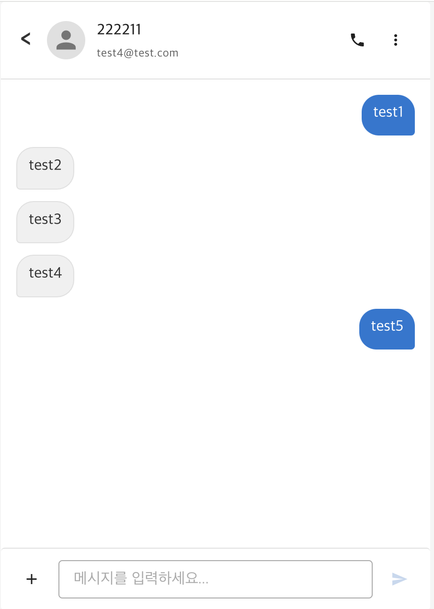

# DevTalk

> 개발자들을 위한 실시간 커뮤니케이션 플랫폼

DevTalk는 개발자들이 기술 스택별로 소통하고, 실시간 채팅을 통해 협업할 수 있는 커뮤니티 플랫폼입니다.

## 주요 기능

### 1. 기술 스택별 게시판


- 기술 스택(JavaScript, Python, Java, React 등)별 필터링
- 게시글 검색 기능
- 좋아요, 댓글, 조회수 표시
- 사용자 프로필과 작성 시간 표시

### 2. 게시글 상세 및 댓글


- 게시글 상세 내용 조회
- 실시간 댓글 시스템
- 게시글 좋아요 및 북마크
- 팔로우 기능으로 개발자 네트워킹

### 3. 실시간 1:1 채팅


- 닉네임/이메일 기반 사용자 검색
- 채팅 목록 관리
- 실시간 메시지 알림

### 4. 채팅방


- WebSocket 기반 실시간 메시징
- 메시지 전송 시간 표시
- 직관적인 채팅 UI/UX

## 기술 스택

### Frontend
- **Vue.js 3** - Progressive JavaScript Framework (Options API)
- **Vuetify 3** - Material Design Component Framework
- **Vue Router** - SPA 라우팅 (Hash 모드)
- **Axios** - HTTP 클라이언트
- **WebSocket** - 실시간 양방향 통신 (SockJS + STOMP)

### 인증 및 상태 관리
- **JWT** - JSON Web Token 기반 인증
- **localStorage** - 토큰 및 사용자 정보 저장

## 프로젝트 구조

```
src/
├── components/
│   ├── chat/           # 채팅 관련 컴포넌트
│   └── common/         # 공통 컴포넌트 (네비게이션 등)
├── views/              # 페이지 컴포넌트
│   ├── Home.vue        # 메인 피드
│   ├── LoginPage.vue   # 로그인
│   ├── SignUp.vue      # 회원가입
│   ├── ChatList.vue    # 채팅 목록
│   ├── ChatRoom.vue    # 채팅방
│   ├── MyPage.vue      # 마이페이지
│   ├── CreateArticle.vue    # 게시글 작성
│   ├── EditArticle.vue      # 게시글 수정
│   └── ArticleDetail.vue    # 게시글 상세
├── router/             # 라우터 설정
├── plugins/            # Vuetify 설정
└── main.js             # 앱 진입점
```

## 시작하기

### 설치
```bash
npm install
```

### 개발 서버 실행
```bash
npm run serve
```
개발 서버는 `http://localhost:3000`에서 실행됩니다.

### 프로덕션 빌드
```bash
npm run build
```

### 코드 린트
```bash
npm run lint
```

## 환경 변수
```env
VUE_APP_API_BASE_URL=http://localhost:8080
```

## 주요 구현 사항

### 인증 시스템
- JWT 토큰 기반 인증
- 라우터 가드를 통한 자동 리다이렉션
- localStorage를 통한 토큰 관리

### 실시간 채팅
- SockJS + STOMP 프로토콜 사용
- WebSocket 연결 생명주기 관리
- 채팅 히스토리 로드 및 표시
- 컴포넌트 언마운트 시 자동 연결 해제

### 라우팅
- Hash 기반 라우팅으로 새로고침 이슈 방지
- 인증이 필요한 페이지와 공개 페이지 구분
- 동적 라우트 파라미터 활용 (게시글 ID, 채팅방 ID)
